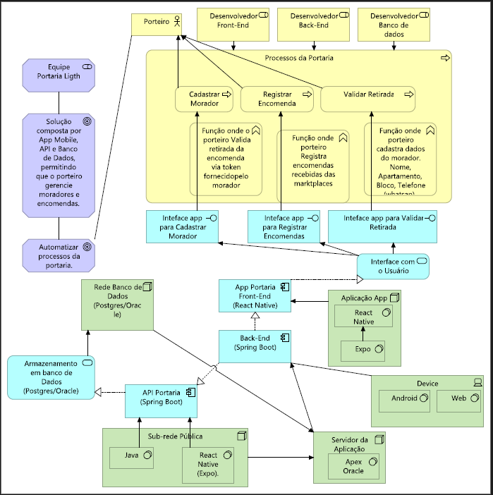
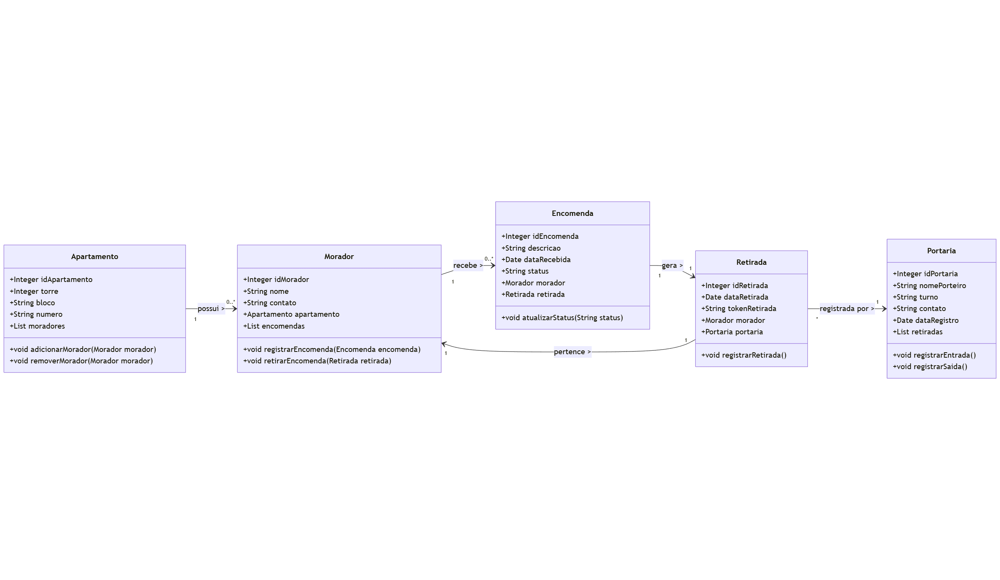
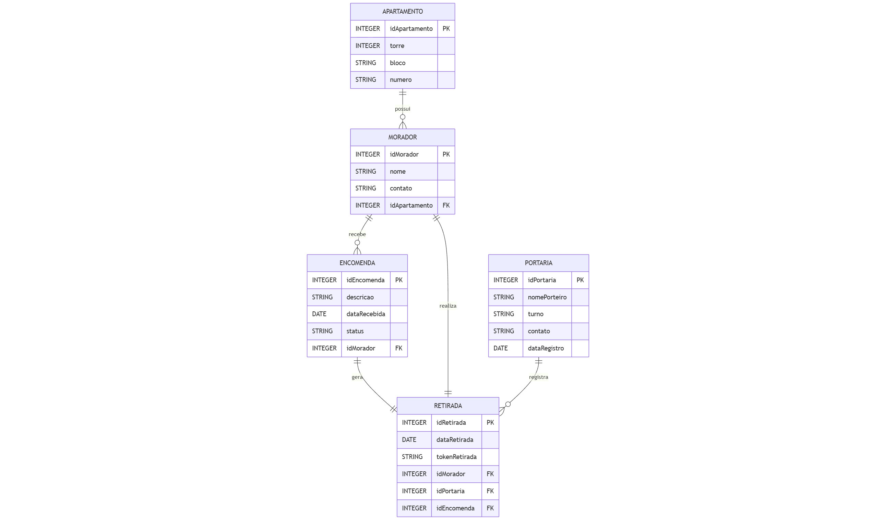

# 🏢 Sistema de Gestão de Portaria

## 📋 Descrição
Sistema para gerenciamento de portaria de condomínio, focado no controle de entrega e retirada de encomendas. A aplicação permite o registro, acompanhamento e controle de encomendas recebidas na portaria, com autenticação via Firebase, mensageria assíncrona com RabbitMQ e comunicação síncrona via Feign Client.

## 👥 Integrantes e Responsabilidades

- **Lucas da Ressurreição Barbosa (RM560179)**
  - Java Advanced
  - IOT
  - Documentação técnica

- **Fabrício José da Silva (RM560694)**
  - Banco de Dados
  - .NET
  - Estrutura total do Banco

- **Ranaldo José da Silva (RM559210)**
  - DevOps e CI/CD
  - Testes de qualidade
  - FrontEnd Mobile

## 🛠️ Tecnologias Utilizadas

- **Backend**: Java 21, Spring Boot 3.5, JPA/Hibernate
- **Segurança**: Spring Security + Firebase Authentication
- **Mensageria**: RabbitMQ (CloudAMQP)
- **Comunicação Síncrona**: Spring Cloud OpenFeign
- **Banco de Dados**: Oracle Database
- **Documentação**: Swagger/OpenAPI
- **Build**: Gradle
- **Controle de Versão**: Git/GitHub

## 🏗️ Diagramas da Arquitetura



### Diagrama de Classes


### DER (Diagrama Entidade-Relacionamento)


### Relacionamentos
- **Morador ↔ Apartamento**: N:1 (Muitos moradores em um apartamento)
- **Encomenda ↔ Morador**: N:1 (Muitas encomendas para um morador)
- **Encomenda ↔ Retirada**: 1:1 (Uma encomenda tem uma retirada)
- **Retirada ↔ Portaria**: N:1 (Muitas retiradas por uma portaria)

## 🚀 Como Executar

### Pré-requisitos
- JDK 21
- Gradle 8.x
- Oracle Database 19c
- Conta no Firebase (para autenticação)
- Conta no CloudAMQP (para mensageria)
- Git

### 1. Clone o repositório
```bash
git clone https://github.com/Lucas2000-student/Sprint-Portaria.git
cd Sprint-Portaria
```

### 2. Configure o Firebase
- Acesse o [Console do Firebase](https://console.firebase.google.com)
- Vá em **Configurações do projeto → Contas de serviço**
- Clique em **Gerar nova chave privada** e baixe o arquivo JSON
- Renomeie o arquivo para `firebase-serviceaccount.json`
- Coloque o arquivo em `src/main/resources/firebase-serviceaccount.json`

> ⚠️ **Nunca suba esse arquivo pro GitHub!** Ele já está no `.gitignore`.

### 3. Configure as variáveis de ambiente

Crie um arquivo `.env` na raiz do projeto com as seguintes variáveis:

```env
# Oracle Database
DB_URL=jdbc:oracle:thin:@//seu_host:1521/xe
DB_USER=seu_usuario
DB_PASS=sua_senha

# RabbitMQ (CloudAMQP)
RABBITMQ_HOST=seu_host.cloudamqp.com
RABBITMQ_USERNAME=seu_usuario
RABBITMQ_PASSWORD=sua_senha
RABBITMQ_VHOST=seu_vhost

# JWT
jwt.secret=SuaChaveSuperSecretaComMaisDe32Caracteres
```

### 4. Execute a aplicação
```bash
./gradlew bootRun
```

### 5. Acesse a aplicação
```
http://localhost:8080
```

### 6. Acesse a documentação Swagger
```
http://localhost:8080/swagger-ui/index.html
```

## 🔐 Autenticação

A autenticação é feita via **Firebase**. O fluxo é:

1. O app mobile autentica o usuário no Firebase
2. O Firebase devolve um `idToken`
3. O app envia o `idToken` para a API no endpoint `/auth/firebase-login`
4. A API valida o token, busca o morador no banco e devolve os dados do usuário

### Tipos de usuário
| Role | Permissões |
|------|-----------|
| `ADMIN` | Acesso total — criar, editar, deletar e consultar |
| `MORADOR` | Somente leitura |

> ℹ️ Usuários `ADMIN` (porteiros) são cadastrados diretamente no banco de dados. Qualquer usuário que se registrar pelo app recebe role `MORADOR` automaticamente.

### Como cadastrar um ADMIN no banco
```sql
INSERT INTO TPL_MORADOR (ID_MORADOR, NOME, CONTATO, FIREBASE_UID, ROLE)
VALUES (1, 'Nome do Porteiro', 'email@portaria.com', 'uid_do_firebase', 'ADMIN');
```

### Como usar o token nas requisições
Após o login, inclua o `idToken` do Firebase no header de todas as requisições:
```
Authorization: Bearer <idToken>
```

## 📚 Endpoints da API

### 🔑 Autenticação (público — não exige token)

| Método | Endpoint | Descrição |
|--------|----------|-----------|
| POST | `/auth/firebase-login` | Login com token Firebase |
| POST | `/auth/firebase-register` | Registro com token Firebase |

**Login:**
- Request
```json
{ "token": "idToken_do_firebase" }
```
- Response:
```json
{
  "uid": "firebase_uid",
  "email": "usuario@email.com",
  "user": { "id": 1, "nome": "João Silva", "role": "MORADOR" }
}
```

**Registro:**
- Request - Response
```json
{ 
  "token": "idToken_do_firebase",
  "nome": "João Silva"
}
```

### 👤 Moradores (exige token)

| Método | Endpoint | Role | Descrição |
|--------|----------|------|-----------|
| GET | `/moradores` | ADMIN, MORADOR | Lista todos os moradores |
| POST | `/moradores` | ADMIN | Cadastra novo morador |
| PUT | `/moradores/{id}` | ADMIN | Atualiza morador |
| DELETE | `/moradores/{id}` | ADMIN | Remove morador |

### 📦 Encomendas (exige token)

| Método | Endpoint | Role | Descrição |
|--------|----------|------|-----------|
| GET | `/encomendas` | ADMIN, MORADOR | Lista todas as encomendas com morador embutido |
| POST | `/encomendas` | ADMIN | Registra encomenda e gera token automático |
| PUT | `/encomendas/{id}` | ADMIN | Atualiza encomenda |
| DELETE | `/encomendas/{id}` | ADMIN | Remove encomenda |
| GET | `/encomendas/token/{token}` | ADMIN | Busca encomenda pelo token — usado no fluxo de retirada |

**Registrar encomenda:**
- Request:
```json
{ 
  "moradorId": 1, 
  "origem": "Mercado Livre", 
  "descricao": "Caixa pequena"
}
```
- Response — token gerado automaticamente:
```json
{
  "id": 1,
  "tokenEncomenda": "A4B1Z",
  "origem": "Mercado Livre",
  "descricao": "Caixa pequena",
  "foiRetirada": false,
  "morador": { "id": 1, "nome": "João Silva" }
}
```

### ✅ Retiradas (exige token)

| Método | Endpoint | Role | Descrição |
|--------|----------|------|-----------|
| POST | `/retiradas` | ADMIN | Registra retirada pelo token da encomenda |

**Registrar retirada:**
- Request — porteiro informa o token falado pelo morador
```json
{ 
  "morador": "João Silva", 
  "encomenda": "A4B1Z"
}
```
A ação marca encomenda como retirada=true e registra timestamp

## 🔄 Fluxos Principais

### Fluxo 1 — Recebimento de Encomenda
```
Porteiro registra encomenda (POST /encomendas)
  → API gera token automático (ex: A4B1Z)
  → Salva no banco com retirada=false
  → Envia mensagem na fila RabbitMQ (fila.encomenda.recebida)
  → Consumer processa e loga a notificação
  → App usa o token para avisar o morador via WhatsApp
```

### Fluxo 2 — Retirada de Encomenda
```
Morador chega na portaria e fala o token
  → Porteiro busca pelo token (GET /encomendas/token/{token})
  → API valida se encomenda existe e não foi retirada ainda (via Feign)
  → Porteiro confirma retirada (POST /retiradas)
  → API marca encomenda como retirada=true e registra timestamp
  → Envia mensagem na fila RabbitMQ (fila.retirada.realizada)
  → Consumer atualiza status automaticamente
```

## 💾 Implementação Técnica

### Spring Security
- Autenticação stateless via Firebase Token
- Dois perfis de acesso: `ADMIN` e `MORADOR`
- Filtro JWT intercepta e valida cada requisição

### RabbitMQ
- Fila `fila.encomenda.recebida` — notificação de nova encomenda
- Fila `fila.retirada.realizada` — notificação de retirada confirmada
- Producers disparam mensagens após cada operação
- Consumers processam de forma assíncrona

### Feign Client
- `EncomendaClient` consulta encomendas via HTTP interno
- Valida status da encomenda antes de registrar retirada
- Garante que encomendas já retiradas não sejam processadas novamente

### Estratégia de IDs
- IDs gerados via `NVL(MAX(ID), 0) + 1` no Oracle
- Procedures para operações de Apartamento e Portaria
- Mapeamento ORM com anotações JPA

## 📊 Funcionalidades

- ✅ Autenticação via Firebase com dois perfis de usuário
- ✅ Registro de encomendas com geração automática de token
- ✅ Fluxo completo de retirada por token
- ✅ Mensageria assíncrona com RabbitMQ
- ✅ Comunicação síncrona via Feign Client
- ✅ API RESTful documentada com Swagger
- ✅ Validações nos serviços de criação e atualização
- ✅ Procedures Oracle para operações críticas

## 🎥 Vídeo de Apresentação

[📹 Assista ao vídeo](https://youtu.be/jH_lAsU8PXg)
